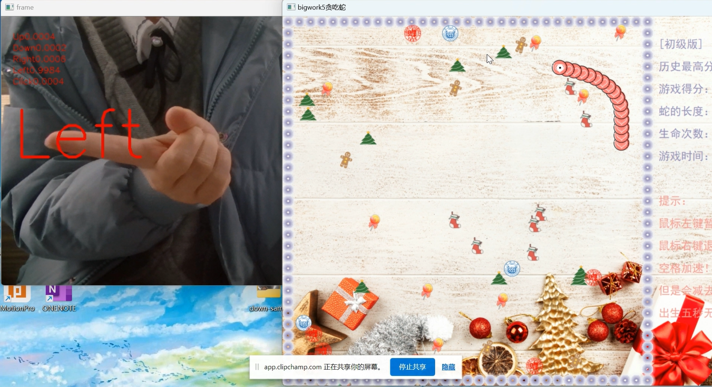
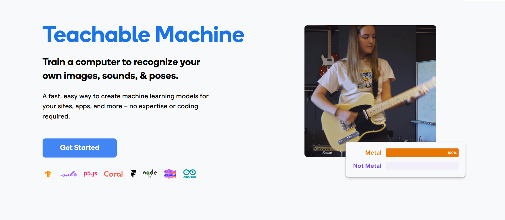
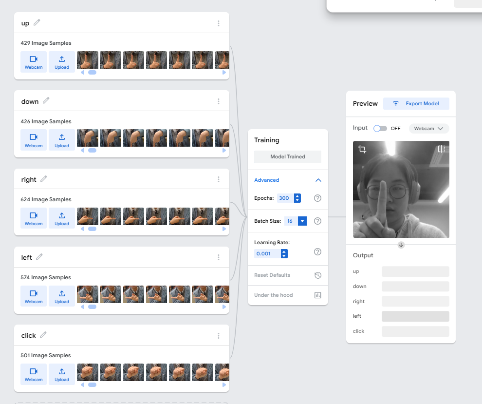
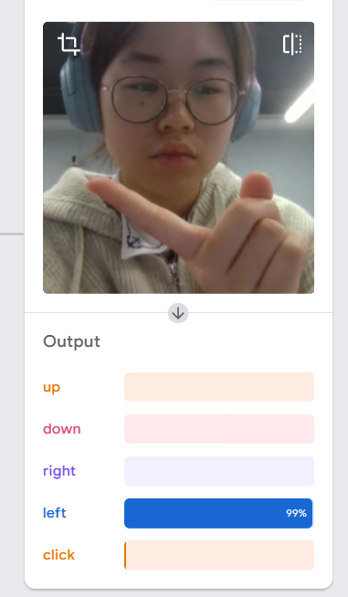
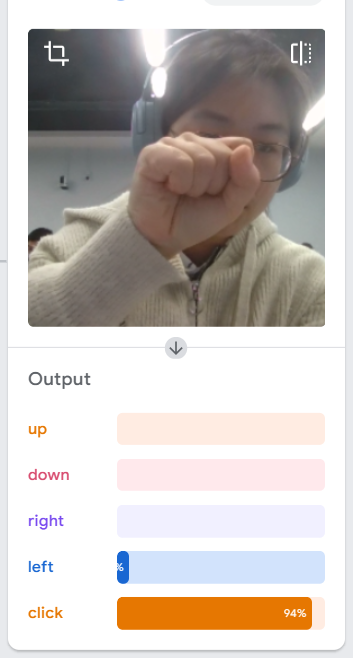
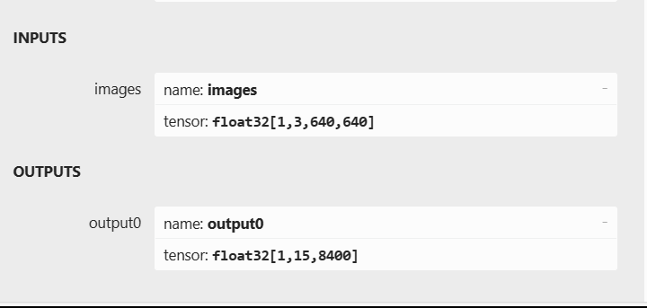
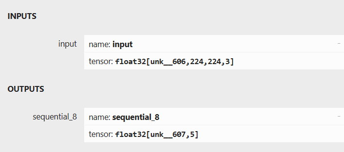
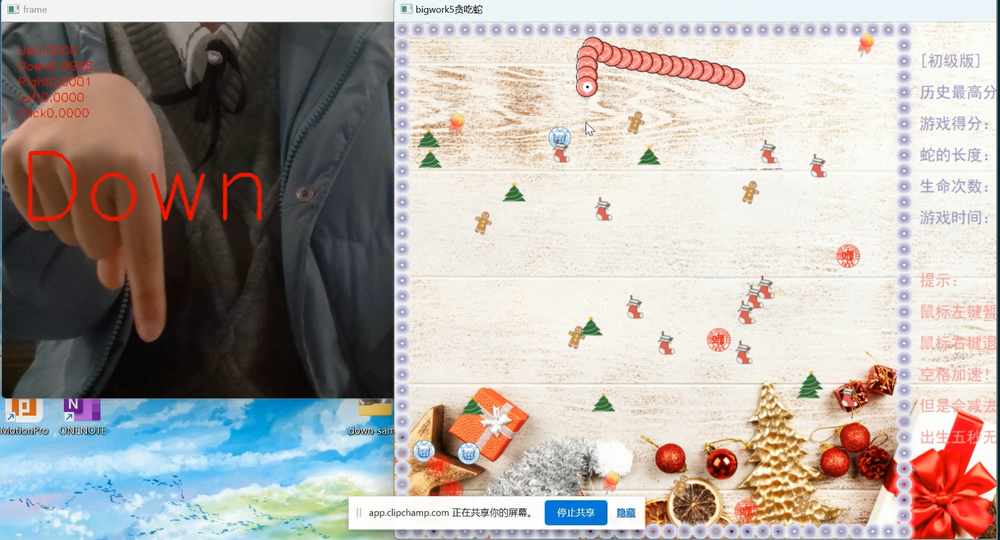
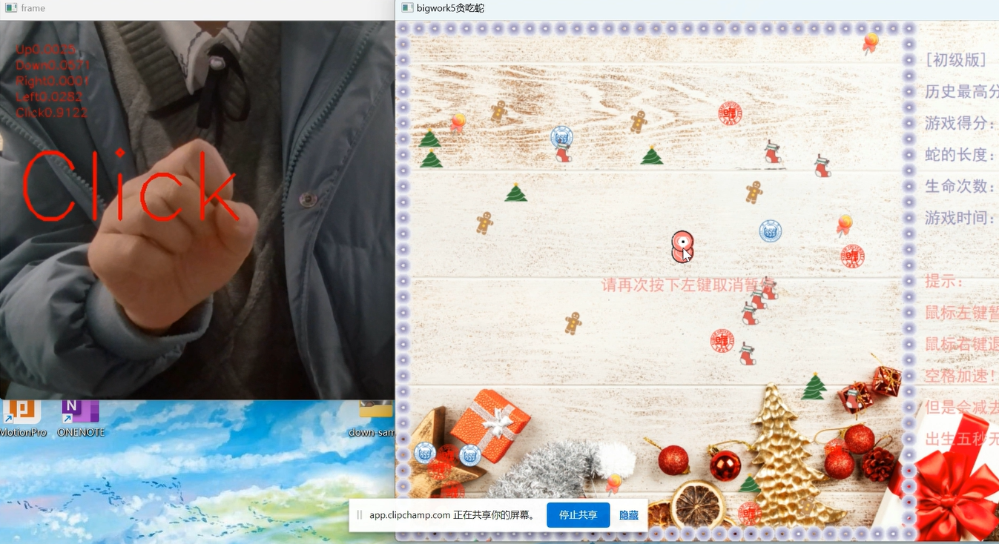

## 
 实验说明文档——teachable machine & 贪吃蛇 2.0 

##### 
 杨瑞灵 2252941 

### 1. 实验要求

- 作业 1：基于 Google Teachable Machine 实现一个计算机视觉应用创意并展示
- 实验目标：发挥个人创作力和想象力，独立完成一个计算机视觉应用小创意。
- 优秀的同学可以不仅限于图像的分类，可通过 Teachable Machine 平台扩展应用到声音、姿态等应用了解计算机视觉的基本原理，并对计算机视觉有初步了解。
- 学有余力的同学可以尝试用 pvthon 编写一些简单识别分类网络，如手写数字识别等。

- 平台使用非常简单：
  - 上传数据集，或者开启摄像头截图
  - 设置训练参数，开始训练
  - 导出模型

### 2.实现过程

制作一个识别手势的模型，部署在贪吃蛇程序中，实现手势控制蛇移动

#### 2.1 训练模型

  
  
  

- 使用图像分类，分为五个类别：up、down、right、left、click，各有 500 张左右图片，epochs 为 300，其他参数默认
- h5 格式导出

#### 2.2 h5 转 onnx

- 因为我的贪吃蛇程序是 c++，而 h5 是 tensorflow 框架下的文件格式，所以我需要先把它转成通用格式 onnx 再部署到 c++上.
- 这一步花了我很多时间，首先配置环境，不同版本的 tensorflow 需要配置不同版本的 keras 和 python，我查了官方文档最后选择用**tensorflow\==2.6.0，keras==2.6.0**
- 最开始我用的**keras2onnx 库**，在多次报错和查阅了很多资料后，我才发现这个库很早就不维护了，所以和现在新的版本冲突，无法使用
- 后来我发现**tf2onnx 库**也能转文件格式，代码我放在作业里面一起提交了

#### 2.3 onnxruntime 部署

- 最开始我是在纠结用**onnxruntime**还是**openvino**，不过比较轻量级的模型应该两者没什么大的区别，最后我选择使用 onnxruntime。然后我被它坑惨了 qwq

##### NCHW 和 NHWC

- 我们知道 yolov8 的 inputs outputs 是这样的
  
  但是我这次导出的模型是这样的
  
- 注意到前者 inputs 的顺序是**N 通道数 height weight**，后者是**N height weight 通道数**
- 如果是 openvino 就不需要考虑这么多，它的图像预处理可以直接调用函数，但是 onnxruntime 需要自己写前处理，在把二维数组转成一维数组的时候，如果是前者（NCHW）需要先 R 的排完再 G 再 B 的形式，但是如果是后者（NHWC）则需要每个像素点 RGB 排完再下一个像素点

##### 标准化和归一化

- onnxruntime 一般来说是采用归一化的方式直接除以 255.0，但是我试了试效果并不好，最后偶然在百度上看见有人使用归一化来处理图像，试了试竟然成功了。
- 不过我还是没有搞明白这里面内部逻辑，为什么之前用归一化都可以但是这次的模型就需要标准化？

### 3.结果展示

- 视频在文件中
  
  

### 4.体会

- 熟悉了 keras 转 onnx 的方法
- 学会用 onnxruntime 部署不同类型的模型
- 不足之处在于**训练集没有做图像处理导致泛化性较差**，从视频中可以看出来一旦手指没有全部包含在图片中，或者指向较为随意可能出现预测错误的情况。
- 如果真的要做神经网络可能还是得修改已经写好的模型，或者就自己手写，teachable machine 感觉只是一个供大家体会机器学习网站，适用范围还是挺有限的？
- 刚刚接触神经网络，还有许多要学习的地方，现在也只是七七八八知道大概网络结构，真要我动手改模型还是挺无从下手，就平时多学习一下，慢慢来
