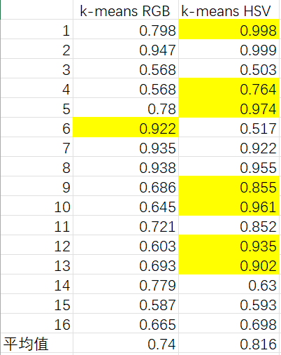
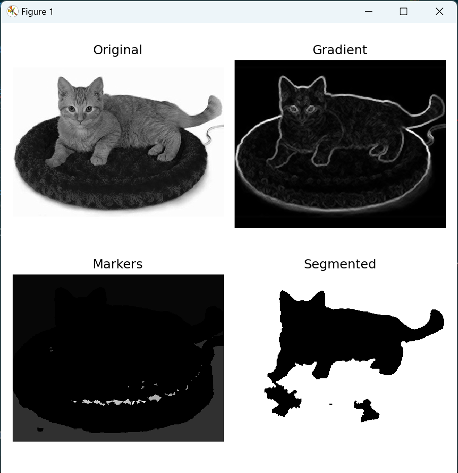

## <center> 实验说明文档——In Defense of the Triplet Loss for Person Re-Identification 实现 </center>

##### <center> 杨瑞灵 2252941 </center>

## 1.论文分析

- 这篇论文《In Defense of the Triplet Loss for Person Re-Identification》主要探讨了在行人再识别任务中使用 Triplet Loss 及其变体的效果。以下是对论文关键内容的详细分析和扩充：
- https://arxiv.org/abs/1912.07863#:~:text=The%20comparative%20losses%20%28typically%2C%20triplet%20loss%29%20are%20appealing,loss%2C%20limiting%20their%20wider%20usage%20in%20massive%20datasets.

### 1.1.图像嵌入（Image Embedding）

- **数据处理**：
  - 论文使用了图像嵌入方法来处理数据，测试了四个角落区域加一个中心区域及它们的水平翻转共十个剪裁方案，然后对所有嵌入进行平均，以得到一个人的最终嵌入。
  - 附录表 5 显示了五种可能的嵌入方式对 Market-1501 数据集上的影响。研究发现，原始图像缩放以适应网络输入（第一行）是最差的选择，因为这会向网络展示一种它以前从未见过的图像类型。简单地翻转和中心裁剪并平均两个结果的嵌入已经有很大的提升。四个额外的角落裁剪虽然效果有限且计算量较大，但结合使用多种增强方式可以得到最佳结果。

### 1.2.训练策略

- **指数衰减学习率**：
  - 训练过程中使用指数衰减（Exponential Decay）来调整学习率，这样可以在训练初期快速收敛，而在训练后期更精确地寻找收敛点，避免因为学习率过大而“冲过了头”。

### 1.3.改进的三重损失（Triplet Loss）

- **损失函数变体**：

  - 论文主要比较了几种不同的三重损失（Triplet Loss）变体，包括 $L_{tri}$, $L_{BH}$, $L_{BA}$, $L_{LG}$, $L_{L}$。研究发现，Batch Hard 几乎总是优于其他三重损失。
    

- **Triplet Loss 三重损失**：

  - 观察发现，Triplet Loss 与多类 SVM 损失非常相似，都是只关注差距在一定范围内的值，差距到这个范围以外则直接将 $loss$ 置为 0。它们不像 Softmax 一样希望差距越大越好，而是只要到一定差距即可。
  - 原来的 tri 是对每个人（锚点）计算正样本和负样本的距离差，并要求负样本至少应该比正样本距离锚点远 $m$ 个长度，但是这样对于样本量大的情况非常不友好，甚至是没法实现的。所以作者希望进行一些改进，只选取最有利的三元对计算三重损失。
    $$\mathcal{L}_{\mathrm{tri}}(\theta)=\sum_{\begin{array}{c}a,p,n\\y_a=y_p\neq y_n\end{array}}\left[m+D_{a,p}-D_{a,n}\right]_{+}.$$

- **Batch Hard 三重损失**：

  - Batch Hard 通过在每个训练批次中选择最难的正样本和负样本来计算损失。即在一个小批量的数据中，找到与锚点样本距离最大的正样本和距离最小的负样本。这种方法通过限制样本对的数量，减少了计算量，同时提升了训练效果。
  - 下图展示了 Batch Hard 的示意图：

    $$
    \begin{aligned}\mathcal{L}_{\mathrm{BH}}(\theta;X)=\overbrace{\sum_{i=1}^{P}\sum_{a=1}^{K}}^{\text{all anchors}}\big[m+\overbrace{\max_{p=1\ldots K}D\left(f_{\theta}(x_{a}^{i}),f_{\theta}(x_{p}^{i})\right)}^{\text{hardest positive}}
    -\underbrace{\underset{j=1...P\atop n=1\ldots K, j\neq i}{\operatorname*{min}}D\left(f_\theta(x_a^i),f_\theta(x_n^j)\right)}_{\text{hardest negative}}\big]_+\end{aligned}
    $$

- **Batch All 三重损失**：

  - Batch All 策略使用每个训练批次中的所有可能三元组（anchor, positive, negative）来计算三重损失。如果一个批次包含 $P$ 个不同类别的样本，每个类别有 $K$ 个样本，那么总共有 $PK(PK−K)(K−1)$ 个可能的三元组。
  - 下图展示了 Batch All 的示意图：
    $$\begin{aligned}\mathcal{L}_{\mathrm{BA}}(\theta;X)=\overbrace{\sum_{i=1}^{P}\sum_{a=1}^{K}}^{\text{all anchors}}\overbrace{\sum_{p=1\atop p\neq 1}^{K}}^{\text{all pos.}}\overbrace{\sum_{j=1\atop j\neq i}^{P}\sum_{n=1}^{K}}^{\text{all negatives}}\left[m+d_{j,a,n}^{i,a,p}\right]_{+}\end{aligned}$$
    $$d_{j,a,n}^{i,a,p}=D\left(f_\theta(x_a^i),f_\theta(x_p^i)\right)-D\left(f_\theta(x_a^i),f_\theta(x_n^j)\right).$$

- **Lifted Embedding Loss**：

  - 传统的三元组损失通常只使用一个正样本对，而其余的负样本对被忽略。论文提出了一种基于 PK 批次的 Lifted Embedding 损失的泛化形式，充分利用批次中的信息，并提供更多的正样本对，从而更有效地学习样本之间的相似性。
  - 下图展示了 Lifted Embedding Loss 的示意图：
    $$\mathcal{L}_{\mathrm{L}}(\theta;X)=\sum_{(a,p)\in X}\Big[D_{a,p}+\log\sum_{n\in X\atop n\neq a,n\neq p}\Big(e^{m-D_{a,n}}+e^{m-D_{p,n}}\Big)\Big]_{+}$$
  - 下图是作者改进后的 Lifted Embedding Loss
    $$\mathcal{L}_{\mathrm{LG}}(\theta;X)=\overbrace{\sum_{i=1}^P\sum_{a=1}^K}^{\text{all anchors}}\big[\log\overbrace{\sum_{p=1\atop p\neq a}^Ke^{D\left(f_\theta(x_a^i),f_\theta(x_p^i)\right)}}^{\text{all positives}}+\log\overbrace{\sum_{j=1\atop j\neq i}^P\sum_{n=1}^Ke^{m-D\left(f_\theta(x_a^i),f_\theta(x_n^j)\right)}}^{\text{all negatives}}\big]_+$$

- **Soft-margin**：
  - 在后续实践中，作者使用 Batch Hard 作为损失函数，并用 Soft-margin 代替 Hinge Loss。这样即使已经正确的三元组也能对损失（loss）做出贡献，提高了训练效果。

### 1.4.预训练模型 vs 从头训练

- 作者探讨了使用预训练模型和从头训练的效果差别，结果表明，从头训练的效果并不比预训练模型差多少，而且具有更高的灵活性。

### 1.5.总结

- 论文通过详细实验和分析，证明了 Batch Hard 变体的三重损失在行人再识别任务中的优越性，并提出了一些改进措施来提升模型性能。通过数据增强、使用指数衰减学习率和 Soft-margin 等技术手段，进一步优化了模型效果。

## 2.实现过程

- 本次复现主要针对最重要的一部分，也就是 Triplet Loss 的 Batch Hard 变体进行实现。以下是详细的实现过程：

### 2.1.训练过程

#### 模型架构

1. **预训练模型**：

   - 本次实验使用了预训练模型 ResNet_v1_50。ResNet_v1_50 是一种 差 网 络，具有 75 层深度。
   - 在预训练模型的基础上，增加了两个全连接层，用于整合信息和提取特 征。这种方法能够利用预训练模型的特征提取能力，同时通过新加入的 连 接层进行任务特定的学习。
   - 下图是改进的神经网络模型
     

2. **残差网络（ResNet）**：
   - ResNet 利用残差模块，允许信息在网络层间直接传递，避免梯度消失问题，并能训练非常深的网络。
   - 网络中随机跳过一些卷积层，只优化部分卷积层，这类似于 Dropout，可以防止过拟合。
   - 使用 Batch Normalization 进行归一化处理，防止因为初始化参数不当导致卷积层“死掉”。
   - 下图展示了 ResNet 的基本架构：
     

#### 损失函数

1. **Triplet Loss 的 Batch Hard 变体**：

   - 采用 Triplet Loss 的 Batch Hard 变体，通过在每个训练批次中选择最难的正样本和负样本来计算损失。
   - 使用 Soft-margin 代替 Hinge Loss，即使已经正确分类的三元组也能对损失做出贡献，从而增强模型的训练效果。
   - 设定 margin 为 0.1，公式如下：
     $$
     L*{triplet} = \sum_{i=1}^{N} \max(0, \text{margin} + d(a_i, p_i) - d(a_i, n_i))
     $$
     其中 \( a_i \) 是锚点样本，\( p_i \) 是正样本，\( n_i \) 是负样本，\( d \) 是样本之间的距离。
   - 代码：

   ```py
   def batch_hard(dists, pids, margin, batch_precision_at_k=None):
    with tf.name_scope("batch_hard"):
        # 指示批次中每对样本是否具有相同的身份
        same_identity_mask = tf.equal(tf.expand_dims(pids, axis=1),
                                      tf.expand_dims(pids, axis=0))
        # 指示批次中每对样本是否具有不同的身份
        negative_mask = tf.logical_not(same_identity_mask)
        # 指示批次中每对样本是否为不同身份的正样本
        positive_mask = tf.logical_xor(same_identity_mask,
                                       tf.eye(tf.shape(pids)[0], dtype=tf.bool))

        # 计算每个样本与同身份样本中距离最远的距离
        furthest_positive = tf.reduce_max(dists*tf.cast(positive_mask, tf.float32), axis=1)
        # 每个样本，找到与其不同身份的样本中距离最近的距离
        closest_negative = tf.map_fn(lambda x: tf.reduce_min(tf.boolean_mask(x[0], x[1])),
                                    (dists, negative_mask), tf.float32)

        # 根据边距参数计算损失值
        diff = furthest_positive - closest_negative
        if isinstance(margin, numbers.Real):
            diff = tf.maximum(diff + margin, 0.0)
        elif margin == 'soft':
            diff = tf.nn.softplus(diff)
        elif margin.lower() == 'none':
            pass
        else:
            raise NotImplementedError(
                'The margin {} is not implemented in batch_hard'.format(margin))

    if batch_precision_at_k is None:
        return diff

    # 如果指定了批量精度参数，则计算批次中每个样本的精度和top-k精度
    with tf.name_scope("monitoring"):
        _, indices = tf.nn.top_k(-dists, k=batch_precision_at_k+1)
        indices = indices[:,1:]
        batch_index = tf.tile(
            tf.expand_dims(tf.range(tf.shape(indices)[0]), 1),
            (1, tf.shape(indices)[1]))
        topk_indices = tf.stack((batch_index, indices), -1)
        topk_is_same = tf.gather_nd(same_identity_mask, topk_indices)
        topk_is_same_f32 = tf.cast(topk_is_same, tf.float32)
        top1 = tf.reduce_mean(topk_is_same_f32[:,0])
        prec_at_k = tf.reduce_mean(topk_is_same_f32)
        negative_dists = tf.boolean_mask(dists, negative_mask)
        positive_dists = tf.boolean_mask(dists, positive_mask)

        return diff, top1, prec_at_k, topk_is_same, negative_dists, positive_dists
   ```

#### 优化器

1. **Adam Optimizer**：

- 使用 Adam 优化器，其结合了 SGD+Momentum 和 RMSProp 的优点。
- 动量可以防止陷入局部最小值和鞍点，RMSProp 可以对不同方向的斜率进行缩放，防止在较陡的方向上冲得过快。
- Adam 优化器参数设置如下：
  - 学习率：0.0003，指数下降
  - β1：0.9
  - β2：0.999
  - ϵ：1e-8

### 2.2.评估过程

#### 图像嵌入

1. **嵌入处理**：

- 使用训练好的模型最后一个 checkpoint 文件进行图像嵌入。
- 图片预处理采用四个角落区域加一个中心区域及它们的水平翻转共十个剪裁方案，最后对所有嵌入取平均值。
- 在训练阶段没有取平均值，而是使用反转、平均池化等数据增强方法，以增加数据的多样性。

#### 模型评估

1. **评估指标**：

- 使用 Market-1501 数据集进行评估，采用的主要评估指标为 mAP（mean Average Precision）和 Top-1 accuracy。
- mAP 衡量模型在所有查询图像上的平均检索精度，Top-1 accuracy 衡量模型在查询图像上的第一个检索结果的准确率。

2. **评估过程**：

- 使用 query 和 test 数据进行检测，评估模型效果。
- 随机抽取部分样本进行可视化，以查看模型在不同样本上的具体表现。

## 3.结果展示

### 3.1.训练结果

1. **训练曲线**：

- 在训练过程中，记录并展示了如下训练曲线：
  <p align="center">
    <div style="display: inline-block; text-align: center; margin-right: 5%;">
      <span>active_count</span><br />
      
    </div>
    <div style="display: inline-block; text-align: center;">
      <span>batch_top1</span><br />
      
    </div>
  </p>

  <p align="center">
    <div style="display: inline-block; text-align: center; margin-right: 5%;">
      <span>learning_rate</span><br />
      
    </div>
    <div style="display: inline-block; text-align: center;">
      <span>loss</span><br />
      
    </div>
  </p>

2. **嵌入距离**：

- 记录并展示了锚点与正样本、负样本的距离变化曲线： - embedding_dists
   - embedding_neg_dists：锚点和负样本距离，应当越来越大，可以看到平均大概在 28 的位 置
   - embedding_pos_dists：描点和正样本距离，应该越来越小，可以看到平均大概在 8 的位置 负样本
  

3. **模型网络**
   

4. **模型效果**：

- 训练 25000 batch 后，模型在 Market-1501 数据集上的结果如下：

  - **mAP：56.70%**
  - **Top-1：73.31%**
    

- 对比论文结果：

  - **论文结果 mAP：65.77%**
  - **论文结果 Top-1：84.69%**
    

- 结果分析：与论文结果相比差距约 10%，这种差距的原因可能涉及到多个方面：
  - **超参数调优不足**：模型的性能很大程度上依赖于超参数的选择，包括学习率、批次大小、margin 等。但是由于设备限制训练一次要很长时间，所以可能没有办法充分调节超参数。同时 batch_k 和 batch_p 设置较小。
  - **数据处理和数据增强的差异**：训练时候没有使用数据增强操作。

### 3.2.可视化结果

1. **评估图片可视化**：

- 随机抽取三个人的查询结果进行可视化，查看模型的具体表现。
  - 1187：共有 5 张，找到 5 张，正确 5 张，错误 0 张，准确率 100%，找出率 100%
    
  - 0740：共有 3 张，找到 5 张，正确 3 张，错误 2 张，准确率 60%，找出率 100%
    
  - 0049：共有 5 张，找到 5 张，正确 5 张，错误 0 张，准确率 100%，找出率 100%
    
- 从可视化结果可以看出，模型在部分样本上的表现较为准确，尽管总体准确率不高，但正确的结果几乎都能被找到。

## 4.心得体会

- 在这次复现论文《In Defense of the Triplet Loss for Person Re-Identification》的过程中，我学到了很多深刻的技术细节和研究方法，对深度学习及其应用有了更深入的理解。

### 4.1.技术方面的收获

1. **三重损失（Triplet Loss）及其变体**：

- 三重损失在面对样本量大且数据复杂的场景中表现出了优越性。特别是 Batch Hard 变体，通过选择最难的正负样本来计算损失，大大提升了训练效率和模型性能。
- 通过对比 Batch Hard 和 Batch All 的效果，理解了不同损失函数在不同场景中的适用性，这对于后续的研究和模型选择具有指导意义。

2. **数据增强和预处理**：

- 图像嵌入部分的数据增强方法，尤其是四个角落区域加中心区域及它们的水平翻转剪裁方案，对于提升模型的鲁棒性起到了关键作用。
- 实践中发现，训练阶段不平均处理样本，但在评估阶段对样本进行多样化处理，能显著提高模型性能。

3. **优化器的选择**：

- Adam 优化器在这次实验中表现良好，其结合了动量和自适应学习率的优势，避免了局部最小值和鞍点问题。

### 4.2.实践中的挑战和解决方案

1. **超参数调节**：

- 由于计算资源和时间限制，没有足够的时间去细致地调整超参数，导致最终结果和论文中有一定差距。未来如果有更多的资源和时间，将通过系统的超参数搜索来优化模型性能。

2. **计算资源的限制**：

- 本地计算资源有限，无法使用更大批次的训练数据，这直接影响了模型的效果。未来可以尝试使用云计算资源或者高性能计算平台来提升训练效率。

3. **复现难点**：

- 尽管跟随论文中的方法，但由于某些细节的实现差异，结果并未完全达到预期。通过不断的实验和调试，逐步接近论文中的结果，过程中学到了很多细节处理和调试方法。

### 4.3.对未来研究的启发

1. **持续改进模型**：

- 通过这次实验，认识到即使是一个看似简单的损失函数，背后也有很多细节需要优化。研究中，要更加关注细节的改进，不断提升模型性能。

2. **新技术的探索**：

- 这次实验激发了我对其他损失函数和优化方法的兴趣，之后会尝试更多新的技术手段，进一步提升行人再识别的效果。

3. **实际应用的思考**：

- 在实际应用中，模型的鲁棒性和泛化能力非常重要。数据增强和预处理的方法在实际应用中具有很大价值，这也是未来研究和实践中需要重点关注的方向。

- 这次实验不仅让我掌握了行人再识别领域的一些关键技术，还让我对科研过程中的严谨性和细致性有了更深的体会。通过不断的实验和调试，不仅提升了技术能力，也培养了科研素养和解决问题的能力。

## 5.引用

- Hermans A, Beyer L, Leibe B. In defense of the triplet loss for person re-identification[J]. arXiv preprint arXiv:1703.07737, 2017.
- Schroff F, Kalenichenko D, Philbin J. Facenet: A unified embedding for face recognition and clustering[C]//Proceedings of the IEEE conference on computer vision and pattern recognition. 2015: 815-823.

```

```
