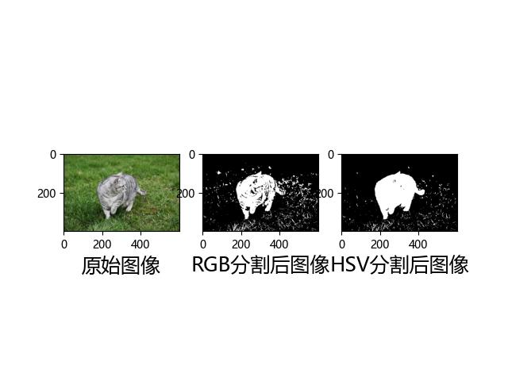
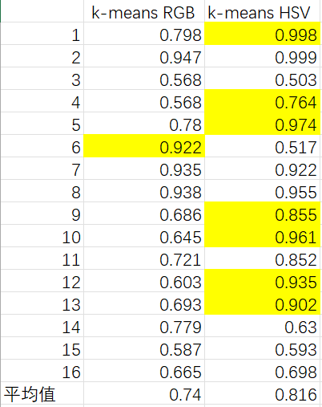
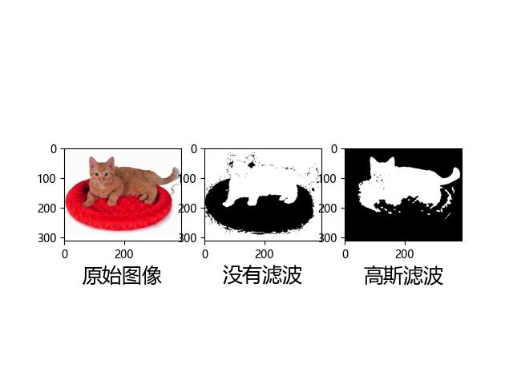
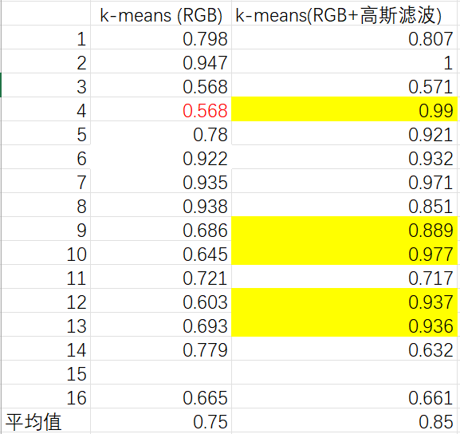
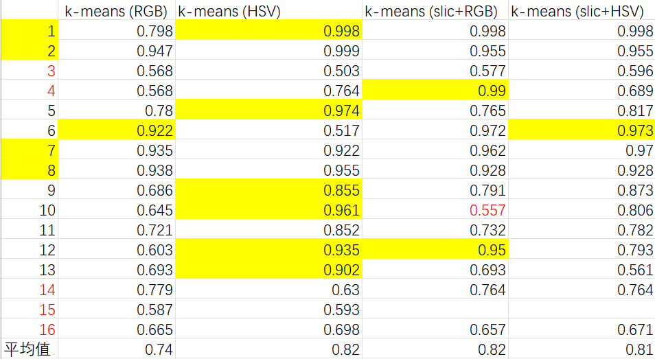
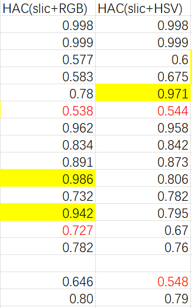
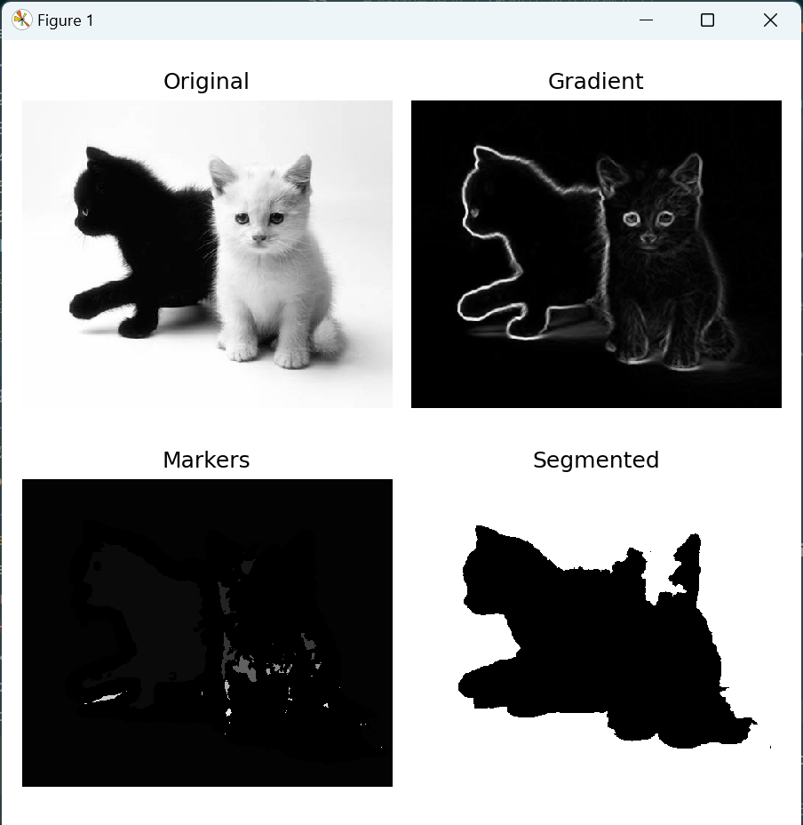
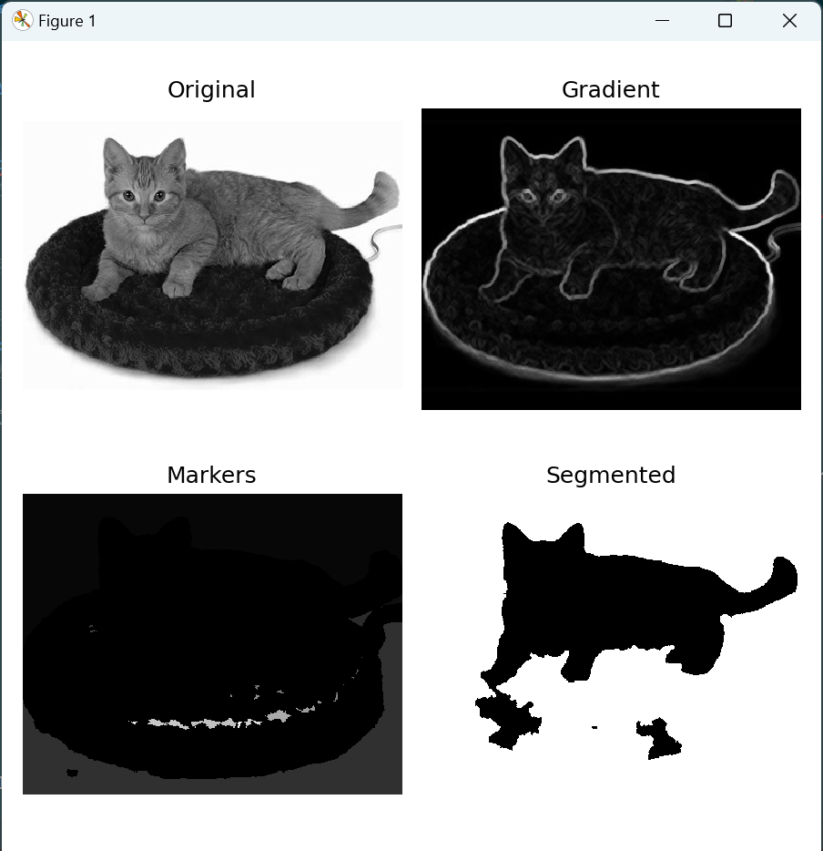
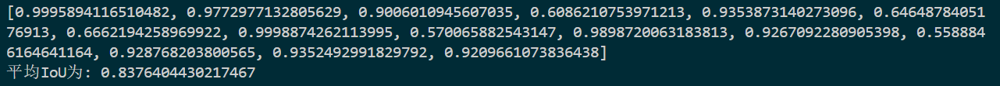
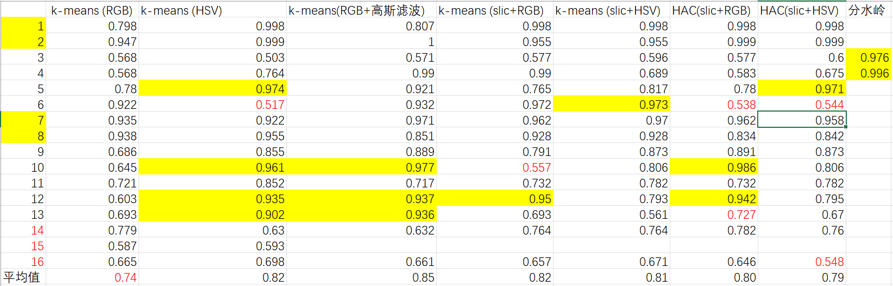

## 
 实验说明文档——基础核心分类/聚类算法编码实现 

##### 
 杨瑞灵 2252941 

### 1. 实验要求

- 理解 K-Means 及 HAC 算法聚类原理。
- 使用 Python 实现 K-Means 聚类算法。
- 使用 Python 实现 HAC 聚类算法。
- 基于两种算法提取图像特征序列进行图像分割。
- 对分割结果使用给定的 Groundtruth 图像进行评估。

### 2.实现过程

- 本次实验选用 k-means 和层次聚类算法进行图像分割
- 由于只是简单的聚类方法，没有加入监督学习等，所以一些背景和整体相近的图片必然没法进行非常好的识别。即使用了不同的优化方法，IOU 测出来仍然在在 0.7-0.9 之间
- 图片和序号对应如下
  | 序号 | 名称 |
  |------|---------------------------------|
  | 1.png | black_kitten |
  | 2.png | black_kitten_star |
  | 3.png | black-white-kittens2 |
  | 4.png | cat_bed |
  | 5.png | cat_grumpy |
  | 6.png | cat_mouse |
  | 7.png | cat-jumping-running-grass |
  | 8.png | cutest-cat-ever-snoopy-sleeping|
  | 9.png | grey-american-shorthair |
  | 10.png | grey-cat-grass |
  | 11.png | kitten9 |
  | 12.png | kitten16 |
  | 13.png | stripey-kitty |
  | 14.png | the-black-white-kittens |
  | 15.png | tortoiseshell_shell_cat |
  | 16.png | young-calico-cat |

#### 2.1 k-means

- 手动写了 kmeans 算法的实现（在 kmeans.py）用的是 random 初始化方法，不过效果还不错和 sklearn 的 KMeans 算出来差不多的 IOU

##### 2.1.1 RGB VS HSV

- 只选用颜色作为特征，不同的颜色空间测出来的结果不同
- 这张图片的 RGB 为 0.645 HSV 为 0.961，可以看出来 HSV 测出来的图片内部噪点减少了很多
  
- 总的来说 HSV 空间下图片分割的结果好于 RGB 空间下的结果,但也不是所有的图片 HSV 都优于 RGB
  

##### 2.1.2 高斯滤波

- 高斯滤波使得图片更平滑，去掉噪点，对于结果有一定提升作用，最明显的是第四张图片
- 不加滤波 IOU 为 0.586
- 加了滤波 IOU 为 0.995
  
- 平均 IOU 提升了 10%
  

##### 2.1.2 SLIC 超像素 + k-means

- SLIC 超像素图片分割不仅把图片分割成了较少的块，而且很好的保留了物体的边界，先进行 SLIC，然后在剩余块状的基础上进行 k-means 可能会有更好的效果
- 特征选择：使用**RGB 颜色空间，块的位置，以及高通滤波后的 01 像素**作为特征，归一化后，权重赋值[1,1,1,0.3,0.3,1]。
- 权重选择：这个权重是我进行多次试验后得来的。我发现如果块的位置信息赋值太高会使得整个图片两边分，这可能是因为物体在图片中心，虽然位置信息使得分块在一起，但是也使得背景块难以赛选出来作为整体
- 最后结果其实并没有很大进步，依然在百分之八十附近，相比于直接 k-means 没有特别大改善
  

#### 2.2 HAC

- AgglomerativeClustering 由于初始化的时候是多少像素点就多少类别，然后一个一个合并，所以无论是我自己写的（在 HAC.py）还是 sklearn 带的 AgglomerativeClustering 类都没法在短时间类完成图片分割。我还是先 SLIC 超像素处理到 100 个点左右,再进行层次聚类,效果没什么突出的地方,比 k-means 慢且准确率要低

  

#### 2.3 分水岭

- 我们发现第三张图因为背景色和白猫相近，所以 IOU 结果都在 0.6 一下。所以显然颜色无法对这张图片进行分割，我们考虑找边界，用 canny 算子或者梯度筛选去寻找边界，再对内部进行填充，都能够获得比较不错的效果。
- IOU:0.976
  
- 第四张图片的红色垫子之前一般都是会和猫一起抠出来,这里用梯度去筛选一下,能够比较好的筛掉垫子留下猫
- IOU:0.996
  
- 平均 IOU=0.837
  
-
- 可以把分水岭的结果放进 k-means 里面做聚类,实验发现虽然有些图片结果变好但是平均 IOU 没什么变化.可能是因为分水岭对于背景变化较大的图片效果不太好，只针对背景单一，主体明显的图

### 3.结果展示

- 高斯滤波和用 HSV 对结果影响较大,其他方法中,分水岭针对背景干净变化小的图片
  

### 4.体会

- 因为是无监督学习算法，只是传统的提取特征进行分类，所以对于像第二张一样黑白分明的图片效果较好。对于像第 3,4 张图片，背景和猫的颜色相近，或者猫和物体颜色相近的，那么很难不把猫和物体或者背景分到一块去
- 再比如第 7 张图片，背景草地和猫都有明显高通滤波变化，分类的时候猫和下半部分草地会分在一块，除非获得了猫的大概位置和颜色信息用它来赛选，否则只用 k-means 或者层次聚类很难得到像答案一样较为准确的结果
- 对比传统方法和深度学习模型:

  - 光线和环境对传统方法影响比较明显。之前写传统识别的时候就发现，虽然在背景较黑的情况下识别效果较好，但是一但后面有别的光线干扰识别就会出错。这种情况下，神经网络等深度学习方法可能更适合，因为它们能够更好地处理复杂的环境和光照变化，从而提高了识别的准确性。
  - 传统识别方法通常需要手动设计和提取特征。而深度学习模型可以通过端到端的学习过程自动学习特征表示，从而更好地适应不同的数据和任务。

- 特征选择:只用 RGB 肯定没法进行很好的分割。加上位置信息之后，其实效果也没有提升太多，高通滤波可以选出轮廓信息，但是没有办法将猫的内部也筛选出来。最有效果的还是改变颜色空间，HSV 比 RGB 增加了 7%的准确度。其次是高斯滤波可以平滑图片,减小噪点
- 分水岭对于背景干净变化小的图片效果好,比如 3\4 张图片,达到了 90%的准确度
