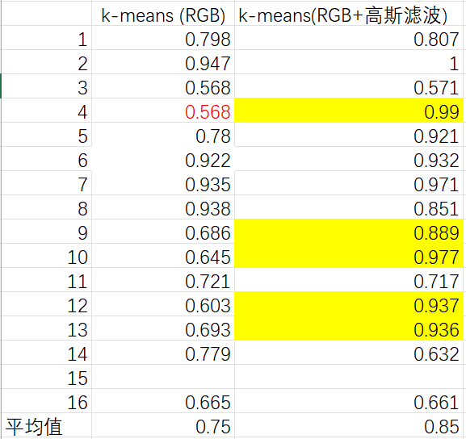
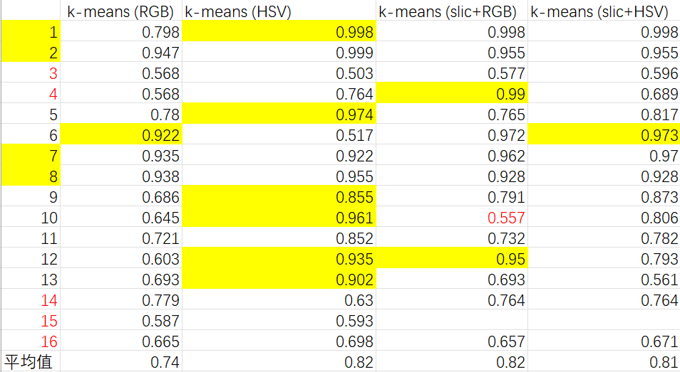

## 
 实验说明文档——knn svm 实现 

##### 
 杨瑞灵 2252941 

## 1. 实验要求

- 使用 Python 实现 k-最近邻（k-NN）分类器。
- 使用 Python 实现支持向量机（SVM）分类器。
- 理解以上分类器的差异和权衡之处。
- 将二者应用到图像分类任务上（如鸢尾花，Cifar10 或 MNIST 数据集）。

## 2.实现过程

- 本次实验选用 knn 和 SVM 进行分类
- 对于鸢尾花数据分类的准确率在 90%以上，而 cifar10 最高可以达到 40%，在运用主成分分析之后准确率有一点点提升
- 作业为两部分
  - my_work 是最开始我自己实现的 knn 和 svm 类，但是 svm 只实现了二分类
  - cs231n_assignment 是 cs231n 第一个作业关于 knn 和 SVM 部分的实现，用的是 cifar10 数据集

### 2.1 knn

- 手动写了 knn 算法的实现类 kneighborsclassifier（在 kneighborsclassifier.py），实现了两种距离算法 weights: Union[Literal['uniform', 'distance'], None] = "uniform"

#### 2.1.1 学习

- knn.ipynb 第一部分是 knn 的学习，最邻近分类算法是数据挖掘分类（classification）技术中最简单的算法之一，其指导思想是”近朱者赤，近墨者黑“，即由你的邻居来推断出你的类别，需要确定的超参数包括 k 的选择以及 weights 是用平均的方法还是距离远近加权。
- 可以用交叉验证等方法来确定超参数
  

#### 2.1.2 鸢尾花

- 鸢尾花数据集的数据个数较少，并且每一个数据都是五个特征，所以无论是 knn 还是 svm 的效果都不错。
  

#### 2.1.3 cifar10

- 对于图片分类，cifar10 是非常有名的数据集，由于数据集太过庞大我们都只选用其中一部分作为训练集，图片分类最有效的还是 CNN，不过用 knn 也能达到 39%的效果，比随机的 10%高了两倍。
  
- 我们把图片 32*32*3 reshape 一下直接放进 knn，速度非常慢而且准确率不高
  
- 交叉验证确定 k=10 的时候准确度最高，平均达到 28%，但是依然不是一个很好的效果
  
- 用 PCA 特征降维
  
  
  
  
  可以看到 features=25 的时候准确度最高达到 39%，虽然没有提高准确度但是速度变快了

### 2.2 SVM

#### 2.2.1.学习

- SVM 与 knn 的不同在于 knn 训练的时候只是记录，predict 时候花大量时间，这显然是不符合我们实际需求的。而 SVM 训练的时候调整 W 的值，在测试的时候就不需要花时间。
- 手推公式：
  
  
  

#### 2.2.2.鸢尾花

- 不同 gamma 值准确率好像差别有点大，可能是鸢尾花数据集太少了出现了过拟合现象
  

#### 2.2.3.cifar10

- 训练结果：可以看见随着训练次数增加，损失函数再减小然后趋于稳定
  
- 超参数：learning_rates，regularization_strengths，包括正则化项选择 $L_1$ 还是 $L_2$ 还是别的方法等等
  
  统一用的 L2 范式，对比发现 $learning\_rates=e^{-7},regularization\_strength=30000$ 的时候效果较好
- W:我们把 W 每一列输出一下，发现它长得就很像本来的图片，特别是 car。可以理解为他就是在用我们的 W 去模拟一类图片的形态。这也是为什么 SVM 的准确度低的原因：因为每个事物会有不同的形态，稍微遮挡变形可能和 W 就相差很大了，很可能误识别为别的东西。
  

### 3.结果展示

- 结果图片如 2，分析一下结果。
- KNN：
  - knn 是最简单的分类器，由于它的 train 只是记录数据集，而 predict 需要大量时间计算 $m*n$ 个距离，所以在实际生活中显然不适用。
  - 同时，他对于 L1 还是 L2 甚至更高维度距离计算公式的选择也要考虑，还有 k 的选择，最好做交叉验证在 val 数据集上取最优超参数再在 test 上面验证。
- SVM：
  - 支持向量机原本是二分类，但是我们也可以把它扩展为多分类。他就是训练时间长,但一旦确定 W 就可以很快 predict。
  - 同时 SVM 用的是$L_i=\sum_{j\ne y_i}{\max\{0,s_j-s_{y_i}+1}\}$，而同为线性分类器的 softmax 用的是$L_i=-\log{\frac{e^{s_{yi}}}{\sum_j{e^{s_j}}}}$，它们的区别在于 SVM 一旦超过了 1 的界限他就不会再优化了，而 softmax 会已知把对的更正、错的更负。
  - 对于$R(W)$，如果是$L_1$它更倾向于稀疏矩阵而$L_2$倾向于更平均的矩阵，要选择合适的正则化项
    
    

### 4.体会

- 时间开销
  - 在完成 cs231n 的时候会发现它让我们重复的求矩阵，显示用循环然后用 numpy 的方法，我们会发现用循环的时间会远低于用 np 方法。
    
  - 这是因为 numpy 是一个专门用于处理大规模数组和矩阵运算的库，它在底层实现中使用了高度优化的 C 和 Fortran 代码，而 Python 循环则是解释执行的，速度相对较慢。
    
- KNN 算法的缺点:
  - KNN 算法在分类时有个主要的不足是，当样本不平衡时，如一个类的样本容量很大，而其他类样本容量很小时，有可能导致当输入一个新样本时，该样本的 K 个邻居中大容量类的样本占多数。可以采用权值的方法(和该样本距离小的邻居权值大)来改进。
    
  - 还有一个是数据量的问题，一旦 KNN 分类的种类增多那么它需要的数据量是呈指数倍增长，这就像二维正方形变成正方体，边的长度增加相同但是正方体的增加数量比正方形高一个数量级。那么 predict 的时间开销就会非常大。
- 线性分类器：
  - 相当于 n 维空间里面一个平面去分割这个空间，所以我们可以想象如果数据集不是分开到自己的部分，而是在空间里有几坨，那么线性分类器当然不适用。
  - 但是线性分类器在神经网络中还是占有很重要的地位，因为神经网络是很多层，虽然它单独的效果不是很好，但是可以搭配其他层一起食用 qwq。
- 另：cs231n 讲的真好吧 T_T
